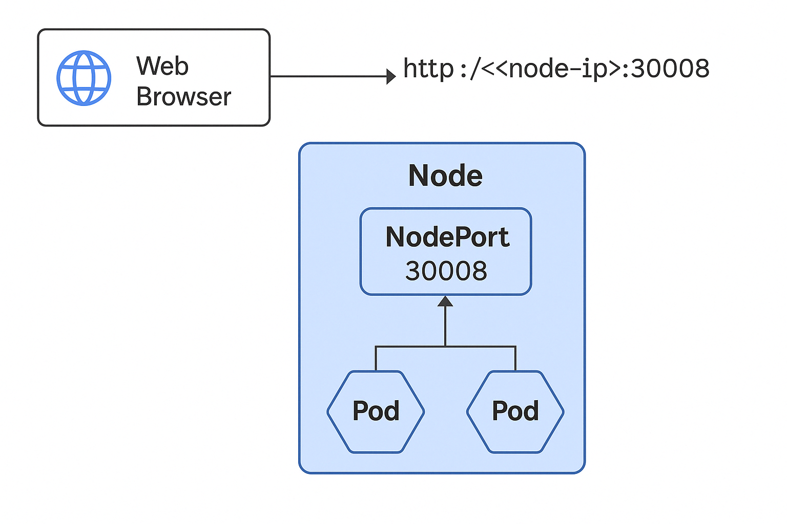

In Kubernetes, **Deployment** and **Service** are two fundamental building blocks, and they **work together** to ensure your app is:

- Always running ✅  
- Scalable 🔁  
- Accessible 📡  

Let me explain both in very **simple and practical terms**:

---

## 🔧 What is a **Deployment**?

A **Deployment** is like a manager that **runs and maintains a set of Pods** (your app containers).

### ✅ Why we use Deployment:

| Feature | Explanation |
|--------|-------------|
| **Scalability** | Easily scale your app up/down (e.g., `replicas: 3`) |
| **Self-healing** | If a pod crashes, it automatically restarts |
| **Declarative Updates** | Handles rolling updates (zero downtime) |
| **Version Control** | Roll back to previous versions if something breaks |

> 🔁 Think of Deployment as a "versioned, auto-healing, always-on manager" for your app pods.

---

## 📡 What is a **Service**?

A **Service** exposes your pods to the outside world **and gives them a stable endpoint**.

### ✅ Why we use Service:

| Feature | Explanation |
|--------|-------------|
| **Stable Access** | Pods have random names/IPs; Service gives one fixed IP |
| **Load Balancing** | Distributes traffic to all pods evenly |
| **Networking** | Lets other services or users talk to your app |
| **Types** | ClusterIP (internal), NodePort (for local dev), LoadBalancer (for cloud) |

> 🌐 Think of Service as a "router + load balancer" that lets others access your app.

---

### 🔁 How They Work Together:

- **Deployment** → ensures your app runs correctly in multiple pods.
- **Service** → exposes those pods to users or other services.

```
+---------------------+        +--------------------+
|    Deployment       | -----> |     Pods (x3)      |
|  (manages pods)     |        |  node-app-xyz123   |
+---------------------+        +--------------------+
                                       |
                              +------------------+
                              |    Service        |
                              |  node-app-service |
                              +------------------+
                                       |
                              http://<cluster-ip>:<port>
```

---

### 🛠 Example in Real Life:
You're deploying a **Node.js app** with MongoDB:

- `Deployment`: ensures 3 replicas of your Node.js app always run
- `Service`: lets frontend or users access the app on a fixed port like `3000`

🛠️ Below is a **fully explained Kubernetes Deployment + Service YAML** example for a **Node.js app** running on port `3000`.

---

## 📄 `node-app-deployment.yaml`

```yaml
apiVersion: apps/v1
kind: Deployment
metadata:
  name: node-app
spec:
  replicas: 3  # Run 3 instances (pods) of this app
  selector:
    matchLabels:
      app: node-app  # This must match pod label
  template:
    metadata:
      labels:
        app: node-app
    spec:
      containers:
        - name: node-app
          image: your-dockerhub-username/node-app:latest
          ports:
            - containerPort: 3000
```

> 🔁 This ensures 3 pods run your app and restart if any fail.

---

## 📄 `node-app-service.yaml`

```yaml
apiVersion: v1
kind: Service
metadata:
  name: node-app-service
spec:
  type: NodePort  # Exposes service on a port accessible from your host
  selector:
    app: node-app  # Routes traffic to pods with this label
  ports:
    - protocol: TCP
      port: 80         # Port exposed internally inside cluster
      targetPort: 3000 # Port on which the app is running inside container
      nodePort: 30008  # Port exposed on your laptop (for local access)
```

> 🌐 This service allows you to access the app at:
```bash
http://<your-node-ip>:30008
# OR
minikube service node-app-service --url
```

---

### ✅ Deploy These:

```bash
kubectl apply -f node-app-deployment.yaml
kubectl apply -f node-app-service.yaml
```


**Additional Info**

Great question! Let’s break this down in very **simple terms**:

---

## 📦 `type: NodePort` in Kubernetes Service

When you create a **Service** in Kubernetes, you must tell Kubernetes **how you want it to expose your app**.

`type: NodePort` means:

> 🔓 **Expose this app on a port on the Kubernetes node itself**, so that **you can access it directly from your browser or Postman** on your local machine.

---

### 📌 So What Does This Do?

Kubernetes will:
1. Reserve a **port between `30000–32767`** on your host machine (or Minikube node).
2. Forward all traffic from that port to your app running inside the cluster.

---

### 🧠 Example:

You write:
```yaml
type: NodePort
ports:
  - port: 80
    targetPort: 3000
    nodePort: 30008
```

🧩 This means:
- `targetPort: 3000`: your app inside the container listens on port 3000
- `port: 80`: internal port (for other services inside cluster)
- `nodePort: 30008`: exposed to **your laptop**, so you can access like:

```bash
http://localhost:30008
# OR if using Minikube:
minikube service node-app-service --url
```

---

### 💬 Do I have to specify `nodePort`?

- **No** – If you don’t give it, Kubernetes will randomly pick a port between `30000-32767`
- But for **local dev**, it's helpful to set a fixed port so you don’t forget it

---

### 📋 Types of Services Recap:

| Type         | Use Case |
|--------------|----------|
| `ClusterIP`  | Default; internal access only (service-to-service) |
| `NodePort`   | Expose service to host machine (browser/Postman) |
| `LoadBalancer` | Expose via external cloud IP (used in AWS, GCP, etc.) |
| `ExternalName` | Points to external DNS like `api.example.com` |

---

- A diagram showing how NodePort routing works




- To use `Ingress` (instead of NodePort) for friendly URLs like `http://node-app.local`

 Let’s upgrade your Kubernetes setup to use **Ingress** – so instead of accessing services with ugly ports like `:30008`, you can use **clean URLs** like:

```
http://node-app.local
http://rabbitmq.local
```

---

## 🔥 Why Use Ingress?

| Feature              | Benefit                                |
|----------------------|----------------------------------------|
| ✅ Clean URLs         | No need for port numbers               |
| 🔄 Routing            | Route multiple domains to different services |
| 🔒 TLS Support        | Easily add HTTPS using cert-manager    |
| 📦 Load balancing     | Handles traffic across Pods internally |

---

## ✅ Step-by-Step Ingress Setup (for local dev)

---

### 1. ✅ Enable Ingress in Minikube
```bash
minikube addons enable ingress
```

---

### 2. ✅ Add Entries to `/etc/hosts`
For Linux/macOS:
```bash
sudo nano /etc/hosts
```

Add:
```
127.0.0.1 node-app.local
127.0.0.1 rabbitmq.local
127.0.0.1 mongo.local
```

For Windows: modify `C:\Windows\System32\drivers\etc\hosts`

---

### 3. ✅ Update Your Services to `ClusterIP`
Ingress works with internal services.

Example:
```yaml
spec:
  type: ClusterIP  # was NodePort earlier
```

---

### 4. ✅ Create an Ingress Resource

```yaml
apiVersion: networking.k8s.io/v1
kind: Ingress
metadata:
  name: app-ingress
  annotations:
    nginx.ingress.kubernetes.io/rewrite-target: /
spec:
  rules:
    - host: node-app.local
      http:
        paths:
          - path: /
            pathType: Prefix
            backend:
              service:
                name: node-app-service
                port:
                  number: 80
    - host: rabbitmq.local
      http:
        paths:
          - path: /
            pathType: Prefix
            backend:
              service:
                name: rabbitmq-service
                port:
                  number: 15672
```

---

### 5. ✅ Apply the Ingress

```bash
kubectl apply -f app-ingress.yaml
```

---

### 6. ✅ Access the Services

Open browser:
- `http://node-app.local` → your app
- `http://rabbitmq.local` → RabbitMQ UI

---