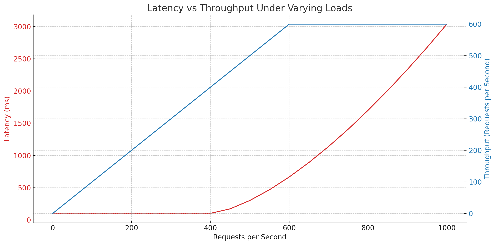

### ⚡ **Latency vs Throughput: Understanding the Core Differences**

Both **Latency** and **Throughput** are key performance metrics in system design, but they measure different aspects of system performance.

---

| **Aspect**              | **Latency**                                  | **Throughput**                                 |
|------------------------|----------------------------------------------|-----------------------------------------------|
| **Definition**          | Time taken to process a single request      | Number of requests processed per unit time   |
| **Unit of Measurement** | Milliseconds (ms), Seconds (s)              | Requests per second (RPS), Transactions/sec  |
| **Focus**               | **Speed** of individual transactions        | **Capacity** of the system                    |
| **Analogy**             | Time it takes for a car to travel from A to B | Number of cars that pass through a highway per hour |
| **Impact on User**      | Affects user experience directly            | Affects system scalability                   |
| **Optimization Goals**  | Reduce delays (e.g., faster API responses)  | Increase capacity (e.g., handle more users)  |
| **Example Use Case**    | Real-time apps (chat, gaming)               | High-traffic web services (e-commerce, APIs) |

---

## 💡 **1. Quick Definitions**
- **🔁 Latency** → *"How long does it take for a single request to get a response?"*  
- **📊 Throughput** → *"How many requests can the system handle in a given time?"*

---

## 🏗️ **2. Visual Example:**

Imagine a **water pipeline**:

- **Latency** is the time it takes for a single drop of water to travel from the source to the end.
- **Throughput** is the total volume of water that passes through the pipe in a minute.

A pipeline can have:
- **Low latency but low throughput** (quick for single requests, but not many at once).
- **High throughput but high latency** (can handle many requests but slower for each).

---

## ⚖️ **3. Latency vs Throughput in Different Scenarios**

| **Application Type**            | **Priority**        | **Reason**                                           |
|---------------------------------|---------------------|-----------------------------------------------------|
| Real-time Games (e.g., Fortnite) | ✅ **Low Latency**   | Users need instant feedback                         |
| Streaming Platforms (e.g., Netflix) | ✅ **High Throughput** | Must serve millions of users simultaneously        |
| Banking Transactions            | ✅ **Low Latency**   | Quick confirmations are crucial                     |
| E-commerce (e.g., Amazon)       | ✅ **Both**          | Fast responses & high traffic handling needed       |

---

## ⚡ **4. Relationship Between Latency & Throughput**
- They often have a **trade-off**:
  - **Increasing throughput** can sometimes **increase latency** (due to queuing).
  - **Reducing latency** might limit the system's capacity (**lower throughput**).

### 🎯 **Ideal Goal:**  
- Optimize both for **balanced performance**.
  
---

## 📊 **5. Optimization Strategies**

| **To Reduce Latency**                      | **To Increase Throughput**                      |
|--------------------------------------------|-------------------------------------------------|
| Use **caching** (e.g., Redis, CDN)         | Implement **load balancing**                    |
| Minimize **network hops**                  | Scale **horizontally** (more servers)           |
| Optimize **DB queries & indexing**         | Use **asynchronous processing** (message queues)|
| Use **compression** for data transfers     | Optimize **connection pooling**                 |
| Deploy servers **closer to users** (CDN)   | Optimize **thread & request handling**          |

---

## ⚔️ **6. Latency vs Throughput: Real-Life Examples**

1. **WhatsApp** → Prioritizes **low latency** for instant messaging.
2. **YouTube** → Prioritizes **high throughput** to stream millions of videos.
3. **Stock Trading Platforms** → Need **extremely low latency** (milliseconds matter).
4. **E-commerce Sales (Black Friday)** → Need **high throughput** to handle traffic spikes.

---

### 💥 **Key Takeaway:**
- **Latency** is about **speed per request**.  
- **Throughput** is about **volume over time**.  

**💡 Optimize based on your use case:**  
- Prioritize **latency** for **real-time apps**.  
- Prioritize **throughput** for **high-traffic systems**.

The graph illustrates the relationship between **Latency** and **Throughput** under varying loads:

- **Throughput** increases with the number of requests until it hits the system's maximum capacity (600 RPS in this case), after which it plateaus.
  
- **Latency** remains stable at first but starts increasing exponentially once the system approaches its capacity limit. This reflects typical behavior under strain, where queues build up, and response times suffer.

This visual helps understand the **trade-off** between maintaining high throughput and low latency. 🚀