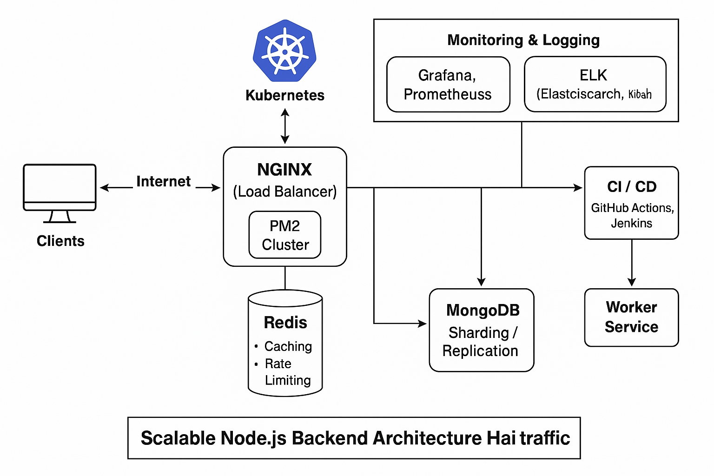

Scaling a Node.js application means making it capable of handling **more traffic, more users, and more requests**, without slowing down or crashing.

Here’s a **step-by-step guide** to help you scale your Node.js app efficiently:

---

## 🧱 1. **Use Clustering (Multi-core Utilization)**
Node.js is single-threaded by default. You can utilize all CPU cores using clustering.

```js
const cluster = require("cluster");
const os = require("os");

if (cluster.isMaster) {
  const cpuCount = os.cpus().length;
  for (let i = 0; i < cpuCount; i++) {
    cluster.fork();
  }
} else {
  require("./app"); // Your express app
}
```

---

## ☁️ 2. **Horizontal Scaling (Multiple Instances)**
Deploy multiple instances of your app across:
- Multiple machines (EC2, containers, etc.)
- Kubernetes Pods
- Docker containers

Use **load balancers** like:
- Nginx
- AWS ELB
- HAProxy

---

## 🗃️ 3. **Use Caching**
Avoid hitting your database or API repeatedly for same data.

✅ Use:
- **Redis** for key-value caching
- **Memory caching** (for small apps)
- CDN for static content

---

## 🪵 4. **Asynchronous & Non-blocking Code**
Avoid `forEach`, heavy loops, and blocking code.

✅ Use:
- `async/await`
- Worker threads or child processes for CPU-heavy tasks
- Queues like **Bull**, **RabbitMQ** for background processing

---

## 🌍 5. **Use a Reverse Proxy**
Use Nginx or Apache in front of Node.js to:
- Handle HTTPS
- Compress responses
- Manage rate limiting

---

## 🧪 6. **Monitoring & Auto-Scaling**
Use tools like:
- **PM2** (process manager with clustering + monitoring)
- **Prometheus + Grafana**
- **Elastic APM / New Relic / Datadog**
- **Auto-scaling** with Kubernetes or cloud provider (e.g., GCP, AWS)

---

## ⚡ 7. **Database Optimization**
- Use **connection pooling**
- Add **indexes** to commonly queried fields
- Use **read replicas**
- Use **sharding** or **partitioning** if needed

---

## 📈 8. **Split to Microservices**
For large apps:
- Split into smaller services
- Communicate via REST or message queues (e.g., Kafka, RabbitMQ)

---

## ✅ Bonus: Use CDN for Static Files
Host static assets (images, CSS, JS) on a CDN to reduce Node.js load.

Great! Here's a **complete architecture** to scale a **large Node.js application** for millions of users — something you might build for a chatbot, e-commerce platform, or stock market tool:

---

### 🧱 **1. Application Layer (Node.js)**
- Use **Express.js / Fastify** with **TypeScript**
- Wrap your business logic in **services**
- Use **DTOs** for input validation (`class-validator`)

✅ **Best practices:**
- Write async code only
- Use proper error handling
- Use dependency injection (e.g., **TypeDI**)

---

### 🔄 **2. Load Balancing**
**Nginx** or **AWS ALB** in front of Node.js app

Responsibilities:
- Load balancing between clustered Node.js instances
- SSL termination
- Caching headers
- Rate limiting

---

### ⚙️ **3. Process Management**
Use **PM2** or **Kubernetes (K8s)** for:
- Auto-restarts on failure
- Memory limits
- Zero-downtime deployment
- Horizontal auto-scaling

Example (PM2 with clustering):
```bash
pm2 start app.js -i max
```

---

### 💾 **4. Database Layer**
Use **MongoDB Atlas** (sharded cluster) or **PostgreSQL** with read replicas.

✅ Good practices:
- Connection pooling (`mongoose` or `pg-pool`)
- Use **indexes**
- Avoid heavy joins
- Archive old data

---

### 🚀 **5. Caching**
Use **Redis** for:
- Session storage
- Rate limiting
- Caching DB/API results

Example:
```js
await redis.set('stock:reliance', JSON.stringify(data), 'EX', 300);
```

---

### 🧵 **6. Background Jobs**
Use **BullMQ**, **Agenda**, or **RabbitMQ** for:
- Sending emails
- Push notifications
- Batch processing

Run jobs in separate worker services.

---

### 📡 **7. API Gateway**
Use **Kong**, **KrakenD**, or **custom Express gateway** to:
- Manage authentication
- Rate limiting
- Logging
- Forwarding to internal microservices

---

### 🌐 **8. Microservices (Optional for huge scale)**
Break app into:
- Auth Service
- User Service
- Analytics Service
- Notification Service

Use **REST or Kafka** for communication.

---

### 🛡️ **9. Security & Rate Limiting**
- Use `helmet` for HTTP headers
- Use `express-rate-limit`
- Sanitize inputs
- Audit dependencies

---

### 📊 **10. Monitoring & Logs**
- **Grafana + Prometheus** for metrics
- **ELK Stack** (Elasticsearch + Logstash + Kibana) for logs
- **Sentry** for error tracking

---

### ☁️ **11. Cloud & Deployment**
Choose:
- **GCP** (with GKE)
- **AWS ECS/EKS**
- **DigitalOcean App Platform**

Use:
- Docker
- CI/CD (GitHub Actions, GitLab, Jenkins)

Perfect! Here's a breakdown of **what I’ll provide next**, based on your confirmation:

1. ✅ **Architecture Diagram** — Full system design showing all services
2. ✅ **Starter Boilerplate** — Node.js + TypeScript + Redis + MongoDB setup
3. ✅ (Optional) React frontend boilerplate if you want it too

Let’s start with the **architecture diagram** 👇

---

### 🖼️ Scalable Node.js App – System Architecture

I'll generate an **image diagram** that includes:

- **Load Balancer** (e.g., Nginx / AWS ALB)
- **Node.js Services** (with PM2 or in Docker containers)
- **Redis** (cache + rate limit)
- **MongoDB** (with replica set or sharding)
- **Message Queue** (BullMQ / RabbitMQ)
- **Background Workers**
- **API Gateway**
- **Monitoring & Logging (Prometheus, Grafana, ELK)**
- **CDN + Frontend (optional)**

